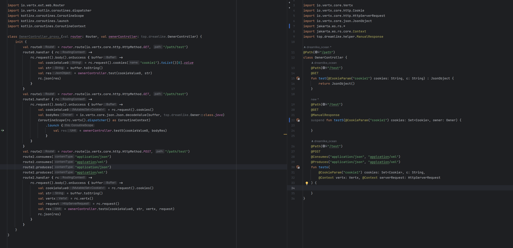

# Vertx-Extension

[English Version](README-EN.md)

[中文版本](README.md)

本项目包含两个模块

* 基于kotlin dsl能力提供更语义化的Vertx-web router绑定

* ksp实现编译期生成jax-rs绑定，类似于Quarkus的[Reactive Router](https://quarkus.io/guides/reactive-routes)

## Vertx-dsl
DSL的实例可以参考[co_router](example/src/main/kotlin/top/dreamlike/App.kt#L48)
### web-router
```kotlin 
val router = Router.router(vertx).co_route {

    GET bindPath "/all" produce "application/json" bindToHandle {
        val res = GLOBAL_FACTORY.openDBScope {
            AsyncMapper<Owner.OwnerMapper, _> {
                this.findAll()
            }
        }
        res
    }
}
```
上图的代码等价于
```kotlin
router.get("all")
    .produce("application/json")
    .handler { 
        CoroutineScope(it.vertx().dispatcher() as CoroutineContext)
            .launch { 
                try { 
                    val res = handle(it)
                    it.response().end(Json.encodeToBuffer(res)) 
                } catch (e: Exception) { 
                    it.fail(e) 
                } 
            }
}
```

一共包含三种形式的bindHandle
* Route.bindToFlowHandle ==> suspend (RoutingContext) -> ReadStream<Buffer>
* Route.bindTo  ==>  suspend (RoutingContext) -> Unit
* bindToHandle ==> suspend (RoutingContext) -> T

其背后原理非常简单
1. 为Router扩展函数 `fun Router.co_route(functions: RouterCoroutineScope.() -> Unit): Router`
2. 其中的RouterCoroutineScope中定义了一组基于kotlin中缀函数和扩展函数特性的Route扩展函数 例如`infix fun Route.produce(contentType: String) = this.produces(contentType)`
3. 最后bindToHandle的实现则是基于以上的原理直接 这样实现即可
```kotlin
  private fun <T> Route.co_handle_result(handle: suspend (RoutingContext) -> T) {
        handler {
            CoroutineScope(it.vertx().dispatcher() as CoroutineContext)
                    .launch {
                        try {
                            val res = handle(it)
                            it.response().end(Json.encodeToBuffer(res))
                        } catch (e: Exception) {
                            it.fail(e)
                        }
                    }
        }
    }
```
### Mybatis-extension

这个功能是为Vertx-web的模型来专门做的，相比于Reactor-netty这些reactive的web framework，Vertx-web具有个很明显的特点——其原生支持且无需额外的代码可以做到Request-Local的Scope，
其在处理一个新请求时会对Router所在Context复制一份，因此使用vertx.currentContext时获取到的Context是Request Local的

因此对于SqlSession的储存位置就可以考虑储存在Context中

那么就剩下一个问题了，mapper的代码在哪执行？当然是线程池，额外的线程池不利于性能表现，所以我这里采用了虚拟线程来运行mapper的jdbc代码，同时将其调度器设置为当前的Context对应的EventLoop

但是这里就还存在一个问题，pinning怎么办，所以这里必须采用适配的virtual thread的jdbc实现和同样做了适配的connection pool实现，这里实例代码使用的是MariaDB和hikariPool用来链接MySQL

这里仍旧采用扩展函数和reified特性来实现需求，为了缩小扩展函数匹配范围，这里必须是为mapper方法继承一个空的标记性接口
```kotlin
suspend inline fun <reified T : MybatisMarkInterface, V> AsyncMapper(
        once: Boolean = true,
        autoCommit: Boolean = true,
        crossinline handle:T.() -> V
    ): V {
        val sqlSession = currentSession() ?: factory.openSession(autoCommit)
        Vertx.currentContext().putLocal(SQL_SESSION_KEY, sqlSession)
        val future = StartOnCurrentContext(context) {
            try {
                sqlSession.getMapper(T::class.java).handle()
            } finally {
                if (once) {
                    sqlSession.close()
                    context.remove(SQL_SESSION_KEY)
                }
            }
        }

        return future.await()
    }
```

## JAX-RS 绑定
这里的实现很简单就是基于KSP来扫注解然后通过编译器解析出来的结构生成Controller代码
使用方法：
```kotlin
var router = Router.router(vertx)
var controller = OwnerController()
Binder.create {
    controller bindTo router
}
```

实例如下:

JAX-RX注解支持情况如下：
* @Path: 只有被@Path标识的类才支持被扫描进而生成代码 暂时不支持正则路径
* @GET @POST等Restful注解完全支持
* @Context目前只支持注入`io.vertx.core.Vertx`,`io.vertx.core.Context`,`io.vertx.core.http.HttpServerRequest`,`io.vertx.core.http.HttpServerResponse`,`io.vertx.ext.web.RoutingContext`, `io.vertx.core.MultiMap`(这个是用来注入header的)
* @Cookie 支持Int,String,Long,Double,Float,BigDecimal,Set<io.vertx.core.http.Cookie>,List<io.vertx.core.http.Cookie>, `io.vertx.core.http.Cookie`作为入参
* @HeaderParam 支持Int,String,Long,Double,Float,BigDecimal作为入参
* @QueryParam 支持Int,String,Long,Double,Float,BigDecimal,Set<String>,List<String>作为入参
* @FormParam 支持Int,String,Long,Double,Float,BigDecimal作为入参
* @MatrixParam 不支持
* @Consumes,@Produces支持
额外：
* 默认情况会将Controller方法返回值以json序列化作为http相应
* 若被@ManualResponse标识的方法需要使用者来发起http响应，比如需要注入`io.vertx.core.http.HttpServerResponse`等Context对象返回
* 支持Controller suspend函数，会用当前的context开启协程

